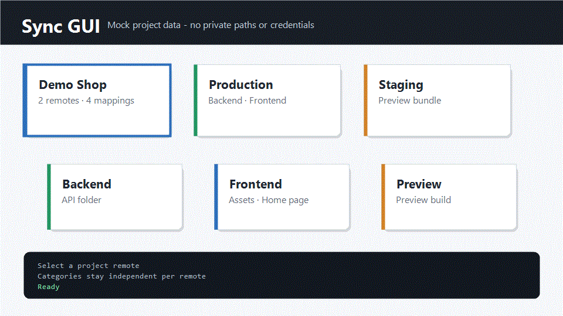

# Sync GUI

Sync GUI is a local desktop/web interface for managing repeatable file sync mappings between projects and remote targets. It is useful when one project has several deployment targets, and each target needs its own independent categories and file/folder mappings.



## Features

- Manage projects, remotes, categories, and file/folder mappings from one UI.
- Keep project remotes independent while reusing shared connection details.
- Sync individual mappings, whole categories, or complete remotes.
- Supports SSH, local folders, and network share style remotes.
- Includes GitHub Actions workflows for CI and release builds.
- Release workflow can publish Windows portable zip, Windows installer, Linux archive, and macOS archives.

## Privacy

This public repository intentionally does **not** include real sync configuration, credentials, server paths, IP addresses, or project data.

Use these local-only files for your own setup:

- `sync-projects.json`
- `.env`

They are ignored by git. Start from the examples:

```powershell
Copy-Item sync-projects.example.json sync-projects.json
Copy-Item .env.example .env
```

## Quick Start

```powershell
npm install
Copy-Item sync-projects.example.json sync-projects.json
Copy-Item .env.example .env
npm run dev
```

Open the local Next.js URL shown in the terminal.

For the Electron app:

```powershell
npm run electron
```

## Build

```powershell
npm run build
```

Create a portable desktop package for your current OS:

```powershell
npm run dist
```

Create a one-file installer/package after building the portable package:

```powershell
npm run installer:win
npm run installer:mac
npm run installer:linux
```

The Windows installer build requires Inno Setup. macOS creates a `.dmg`, and Linux creates an `.AppImage`.

## Configuration

`sync-projects.example.json` shows the public-safe shape:

- `projects[]` define local project roots.
- `remotes[]` define reusable connection details.
- each project remote can point to a reusable remote using `remoteId`.
- each project remote owns its own `categories[]`.

Credentials can be read from `.env` through fields such as:

```json
{
  "hostEnv": "SERVER_HOST",
  "usernameEnv": "SERVER_USERNAME",
  "passwordEnv": "SERVER_PASSWORD"
}
```

## فارسی

# سینک گرافیکی

Sync GUI یک رابط محلی برای مدیریت سینک فایل‌ها و پوشه‌ها بین پروژه‌ها و مقصدهای مختلف است. وقتی یک پروژه چند مقصد مثل production و staging دارد و هر مقصد دسته‌بندی‌ها و مسیرهای خودش را دارد، این ابزار کمک می‌کند همه چیز مرتب و قابل تکرار بماند.

## امکانات

- مدیریت پروژه‌ها، ریموت‌ها، دسته‌بندی‌ها و mappingها از داخل یک UI.
- هر ریموت داخل پروژه دسته‌بندی‌های مستقل خودش را دارد.
- امکان استفاده دوباره از اطلاعات اتصال بین چند ریموت پروژه.
- سینک یک mapping، یک دسته‌بندی کامل، یا کل یک ریموت.
- پشتیبانی از SSH، مسیر محلی، و مسیرهای network share.
- دارای GitHub Actions برای build و release.

## حریم خصوصی

این نسخه عمومی هیچ کانفیگ واقعی، credential، مسیر سرور، IP، یا اطلاعات پروژه خصوصی ندارد.

فایل‌های واقعی خودتان را فقط به صورت local نگه دارید:

- `sync-projects.json`
- `.env`

این فایل‌ها در `.gitignore` قرار دارند. برای شروع از فایل‌های نمونه استفاده کنید:

```powershell
Copy-Item sync-projects.example.json sync-projects.json
Copy-Item .env.example .env
```

## اجرای سریع

```powershell
npm install
Copy-Item sync-projects.example.json sync-projects.json
Copy-Item .env.example .env
npm run dev
```

بعد آدرس محلی Next.js را که در ترمینال نمایش داده می‌شود باز کنید.

برای اجرای نسخه Electron:

```powershell
npm run electron
```

## ساخت خروجی

```powershell
npm run build
npm run dist
```

برای ساخت فایل نصب یا بسته تک‌فایلی، بعد از ساخت نسخه portable:

```powershell
npm run installer:win
npm run installer:mac
npm run installer:linux
```

ساخت installer ویندوز به Inno Setup نیاز دارد. خروجی macOS به صورت `.dmg` و خروجی Linux به صورت `.AppImage` ساخته می‌شود.
